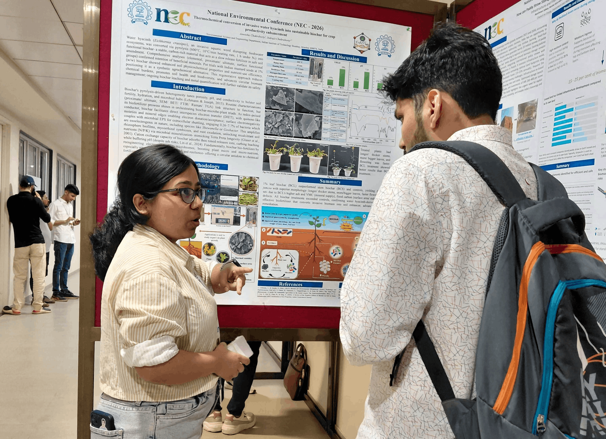

---
hide:
  - toc
  - navigation
---

  
  <h1>Anwesha Chakraborty</h1>
  
<strong>PhD Research Scholar — Indian Institute of Technology Bombay</strong>

  
<em>Plant Biology &nbsp;·&nbsp; Biochar Research &nbsp;·&nbsp; Bioinformatics &nbsp;·&nbsp; Soil Microbiology</em>

---

## About Me

I am a PhD research scholar at the Indian Institute of Technology Bombay (2024–ongoing), working at the intersection of material science, plant biology, and soil microbiology. My research focuses on synthesizing biochar from aquatic weeds via slow pyrolysis and investigating its role as a soil amendment for promoting crop growth. I trace phenotypic effects down to the genotypic level and study community-level shifts in native soil microbiota under prolonged biochar exposure. I am also employing DFT-based computational methods to simulate electronic communication at the biochar–microbe interface — a novel frontier in understanding Extracellular Electron Transfer (EET) in soil systems.

I hold a B.Sc. in Botany Honours from Shri Shikshayatan College (University of Calcutta) and an M.Sc. from Presidency University, West Bengal (CGPA: 8.9/10). With nine peer-reviewed publications spanning plant physiology, mycology, bioinformatics, and ecology, I am committed to science that bridges molecular mechanisms and real-world environmental challenges.

  

---

[View My Research :material-arrow-right:](projects/index.md){ .md-button .md-button--primary }
[Download CV :material-download:](assets/Anwesha-Chakraborty-CV.pdf){ .md-button }

---

## Skills & Expertise

-   :material-leaf:{ .lg .middle } **Plant & Soil Biology**

    ---

    - Biochar synthesis via slow pyrolysis
    - Soil amendment and crop growth analysis
    - Mycorrhizal ecology and fungal biology
    - Plant phenotyping and growth assays

-   :material-dna:{ .lg .middle } **Molecular Biology & Bioinformatics**

    ---

    - Promoter and gene family analysis
    - Secretome and effector protein characterization
    - Intrinsic disorder & structural bioinformatics
    - Tools: FoldIndex, signal peptide prediction

-   :material-atom:{ .lg .middle } **Computational & Quantum Studies**

    ---

    - DFT (Density Functional Theory) simulations
    - Electronic communication modelling at carbon–microbe interfaces
    - Extracellular Electron Transfer (EET) analysis

-   :material-bacteria:{ .lg .middle } **Microbial Ecology**

    ---

    - Soil microbial community profiling
    - Genus and species-level community shift analysis
    - Biochar–microbe interaction studies

-   :material-flask:{ .lg .middle } **Laboratory Techniques**

    ---

    - Material synthesis and characterization (pyrolysis)
    - Molecular biology (DNA extraction, PCR)
    - Plant growth experiments and phenotypic assays

-   :material-file-document-edit:{ .lg .middle } **Academic & Communication**

    ---

    - 9 peer-reviewed publications
    - International oral and poster presentations
    - GATE-XL (2024, 2021) & CSIR-NET qualified
    - Young Academy of India Associate Member

---

## Connect

[ORCID :material-open-in-new:](https://orcid.org/0000-0002-6110-3770){ .md-button }
[Email :material-email:](mailto:24d1261@iitb.ac.in){ .md-button }
